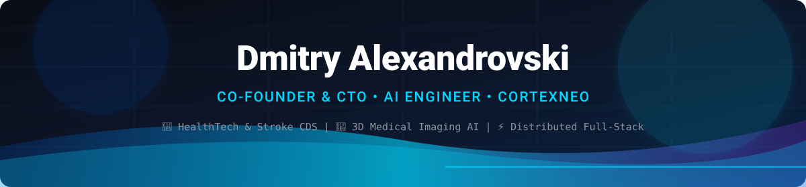

  <!-- Futuristic MedTech & AI Animated Banner -->
  

    

  <!-- Dynamic Animated Typing Bar -->
  

    

  <!-- Quick Action Badges -->
  

    &nbsp;
    &nbsp;
    &nbsp;
    
  

---

## 👋 Hey, I'm Dmitry

I'm an **AI Engineer, Full Stack Developer and Co-founder & CTO of CortexNeo**.

I enjoy building things where **software, AI and real-world problems meet** — from web services and automation to machine learning systems for healthcare.

Right now, most of my time goes into **CortexNeo** — a MedTech startup focused on helping emergency clinicians make faster and more informed decisions when treating ischemic stroke.

---

### 🧠 What I'm building

**CortexNeo** is developing an AI-powered clinical decision support system that analyzes **3D CT data and clinical parameters** to help assess the risk of hemorrhagic transformation after ischemic stroke.

The goal is simple:

> **"Turn complex medical data into clear, explainable information that can help a doctor make a decision when every minute matters."**

The system is being designed around:

* 🧠 **AI/ML analysis** of medical imaging
* 🩻 **3D CT / DICOM** data processing
* 📊 **Clinical data** processing & modeling
* 🔬 **Explainable AI** doctors can trust
* ⚡ **Fast inference** and decision-support pipelines
* 🏥 **Integration** into real clinical workflows

 

  

---

## 🛠️ What I Work With

### 🧠 AI / Machine Learning

  
  
  
  
  

### 💻 Backend / Full Stack

  
  
  
  
  
  

### ⚙️ Infrastructure / Tools

  
  
  
  

### 🏥 Medical Data

  
  

---

## 🚀 Featured Project

### **CortexNeo**
**AI-powered clinical decision support for ischemic stroke**

`Medical Imaging` · `AI/ML` · `MedTech` · `Clinical Decision Support`

 

---

## 📊 GitHub Activity

  

---

## 🌐 Let's Connect

If you're interested in **AI, MedTech, software engineering, startups or building something useful** — feel free to reach out.

  &nbsp;
  &nbsp;
  &nbsp;
  

 

  <!-- Matching Futuristic Footer Wave -->
  

